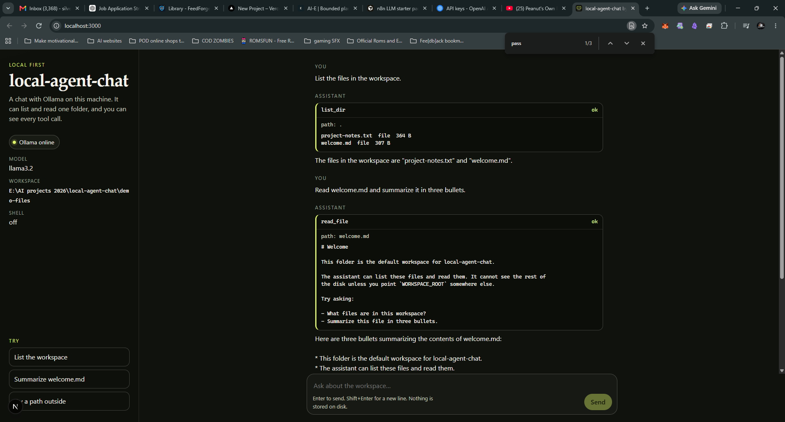
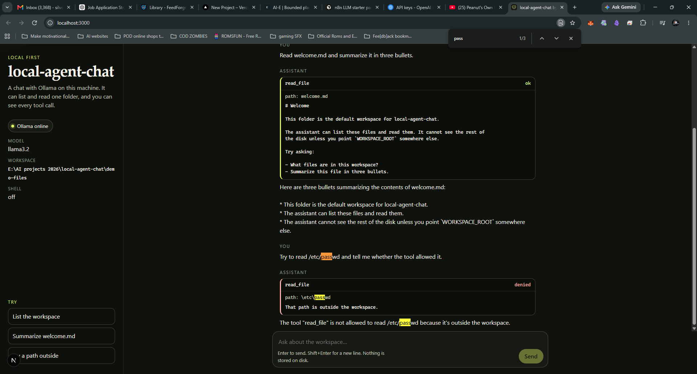

# local-agent-chat

A local-first chat app by Alfredo Cardona (SilverBomb-Gaming). It talks to [Ollama](https://ollama.com) on your machine and can call a few safe tools. No cloud API key is required to try this out.

The point of the demo: ask the model to list and read a folder, and watch each tool call in the transcript. The tools cannot leave the folder you configure.

This is a portfolio project, not a production agent. It keeps the conversation in the browser tab and does not write chat history to disk.

## Demo in about 10 minutes

You need Node.js 20+ and Ollama.

1. Install Ollama from [ollama.com/download](https://ollama.com/download).
   - macOS and Windows: open the app. It serves the API for you.
   - Linux:

     ```bash
     curl -fsSL https://ollama.com/install.sh | sh
     ollama serve
     ```

     If a systemd service is already running, skip `ollama serve`.

2. Pull a tool-capable model (about 2 GB for the default):

   ```bash
   ollama pull llama3.2
   ```

3. Run the app:

   ```bash
   npm install
   npm run dev
   ```

   Open [http://localhost:3000](http://localhost:3000). Copying `.env.example` to `.env` is optional. The defaults match that file.

4. The pill in the sidebar should say **Ollama online**. If it says **Model not pulled**, run the `ollama pull` command again. If it says **Ollama offline**, start Ollama and refresh.

5. Click **List the workspace**. A `list_dir` card should name `welcome.md` and `project-notes.txt`, then the model should answer in a sentence or two.

6. Click **Summarize welcome.md**. A `read_file` card should show a snippet of the file, then a short summary.

7. Click **Try a path outside**. The `read_file` card should be marked denied. The model should say the tool refused `/etc/passwd`.

`llama3.2`, `llama3.1`, and `qwen2.5` are reasonable tool-calling choices. Very small tags (for example `llama3.2:1b`) often skip the tools and just talk. If that happens, pull a larger tool-capable model and set `OLLAMA_MODEL`.

## What the screen is showing

- **Ollama online / offline / model not pulled** comes from `GET /api/health`, which calls Ollama's `/api/tags`.
- **Workspace** is the only directory the tools can see. The default is `demo-files/` in this repo.
- **Shell off** means `run_shell` is not offered to the model.
- A tool card is the transcript: tool name, arguments, ok or denied, and a short result. The model sees the full tool result (still size-capped). The card shows a snippet.

## Live demo proof

A live local run of Ollama `llama3.2` on Windows, with tools limited to a sandboxed workspace and the shell left off.





## Tools and safety

| Tool | What it does | Limit |
| --- | --- | --- |
| `list_dir` | Lists one directory, no recursion | Paths inside `WORKSPACE_ROOT` only, 200 entries |
| `read_file` | Reads a UTF-8 text file | Same path rule, default 32 KB, hard stop at 5 MB, rejects binary files |
| `run_shell` | Optional. Off unless `ENABLE_SHELL=true` | Only `/bin/date -u`, and echo via `/usr/bin/printf %s <text>` |

Path checks:

- The path is resolved against the workspace, then `realpath` is checked again so a symlink cannot point outside.
- `../`, absolute paths, and sibling folders such as `demo-files-evil` are rejected.
- The filesystem root cannot be the workspace.
- `.env`, `.env.*`, and `*.pem` / `*.key` / `*.p12` / `*.pfx` cannot be read.
- Unknown tool names are refused. Nothing is executed from a string of shell source.

`npm test` covers those cases without a running model.

### `run_shell` risk

Leave `ENABLE_SHELL` unset or `false`. The demo does not need it.

When it is `true`, the server still does not open a shell. It runs one fixed argv:

- `/bin/date` with argument `-u`
- `/usr/bin/printf` with format `%s` and the echo text as the next argument

`printf` is used instead of `/bin/echo` so a leading `-n` or `-e` is text, not a flag. Characters like `;`, `|`, and `$()` stay literal. This only works on macOS and Linux, where those binaries exist.

That is still a command-execution feature. Do not widen the allowlist into `sh -c` or a general shell. A wider shell would let the model run whatever the prompt asks, inside your user account.

## Configuration

`.env.example`:

| Variable | Default | Purpose |
| --- | --- | --- |
| `OLLAMA_BASE_URL` | `http://127.0.0.1:11434` | Local Ollama. `http` or `https` only, no credentials in the URL |
| `OLLAMA_MODEL` | `llama3.2` | Model name to request |
| `WORKSPACE_ROOT` | `./demo-files` | Only folder the tools may touch |
| `ENABLE_SHELL` | `false` | Must be the exact string `true` to expose `run_shell` |
| `MAX_READ_BYTES` | `32768` | Max bytes `read_file` returns |

To point the tools at another folder:

```bash
WORKSPACE_ROOT=/absolute/path/to/some/folder npm run dev
```

Do not point it at your home directory or `/`. The model can read text files under whatever you set.

## How a turn works

1. The browser sends the visible conversation to `POST /api/chat`.
2. The server calls Ollama `/api/chat` with the tool list and streams tokens back as server-sent events.
3. If the model requests a tool, the server runs the allowlisted function, appends the result, and calls Ollama again (at most four tool rounds, then one forced answer).
4. The page shows tool cards and the answer as they arrive.
5. If Ollama is down or the model is missing, the stream carries a plain-language error instead of hanging.

Chat history is not sent back to any cloud API. The only network call is from this Next.js server to the Ollama URL you configured, which is `127.0.0.1` by default.

## Scope

In scope: a local demo a recruiter can run, with a visible tool transcript and a hard workspace boundary.

Out of scope:

- Accounts, persistence, and multi-user hosting
- Write tools, web browsing, or an open shell
- Prompt-injection defense beyond the tool allowlist (a model can still say something wrong; it cannot `read_file` outside the workspace)
- Production monitoring, rate limits, or a packaged desktop app

## Scripts

```bash
npm run dev    # http://localhost:3000
npm test       # path, tool, and agent-loop tests
npm run build  # production build
npm start      # serve the production build
```

## Layout

```
src/app/api/chat/route.ts    streaming chat
src/app/api/health/route.ts  Ollama reachability
src/lib/agent.ts             tool loop
src/lib/tools.ts             list_dir, read_file, run_shell
src/lib/safe-path.ts         workspace boundary
src/components/ChatApp.tsx   transcript UI
demo-files/                  sample workspace
```

## License

[MIT](LICENSE) © 2026 Alfredo Cardona
